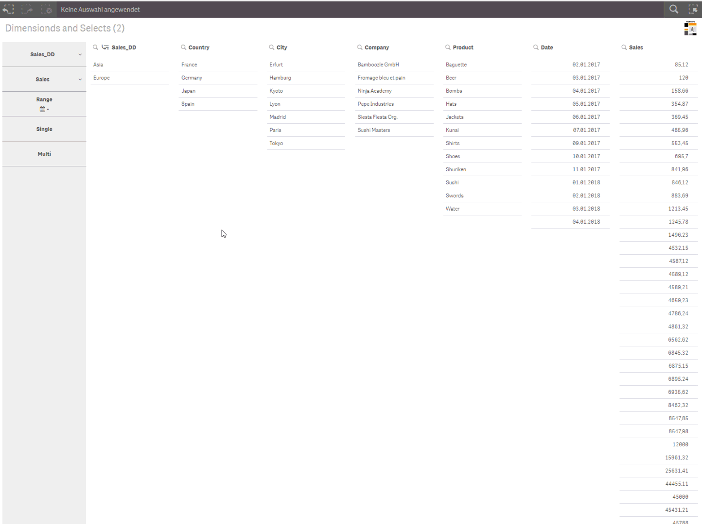
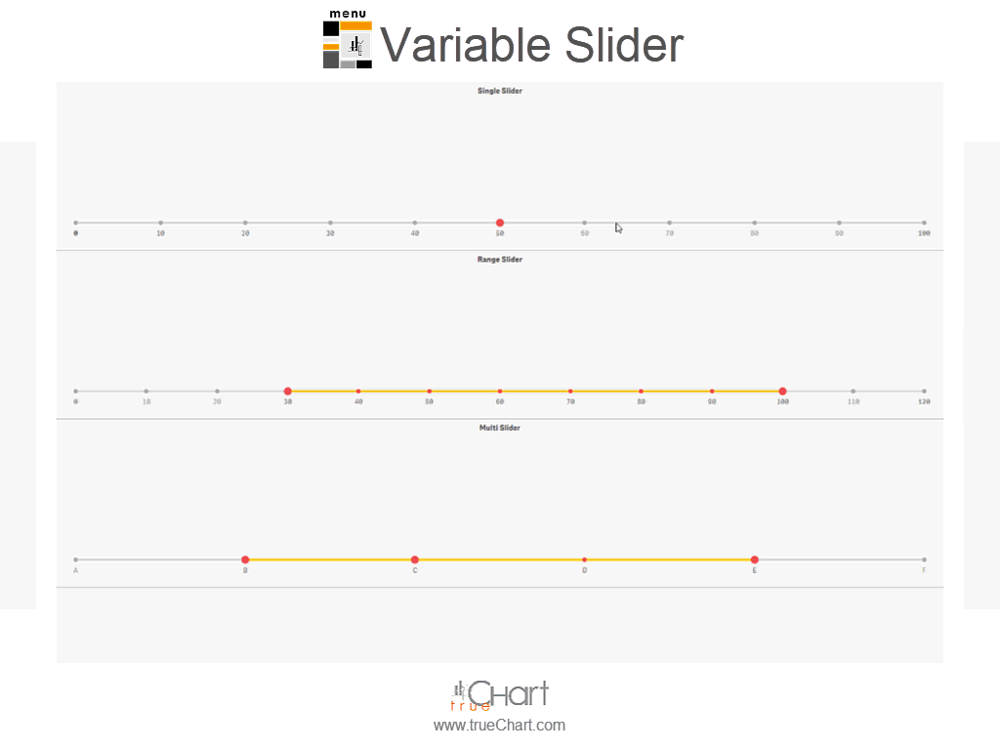
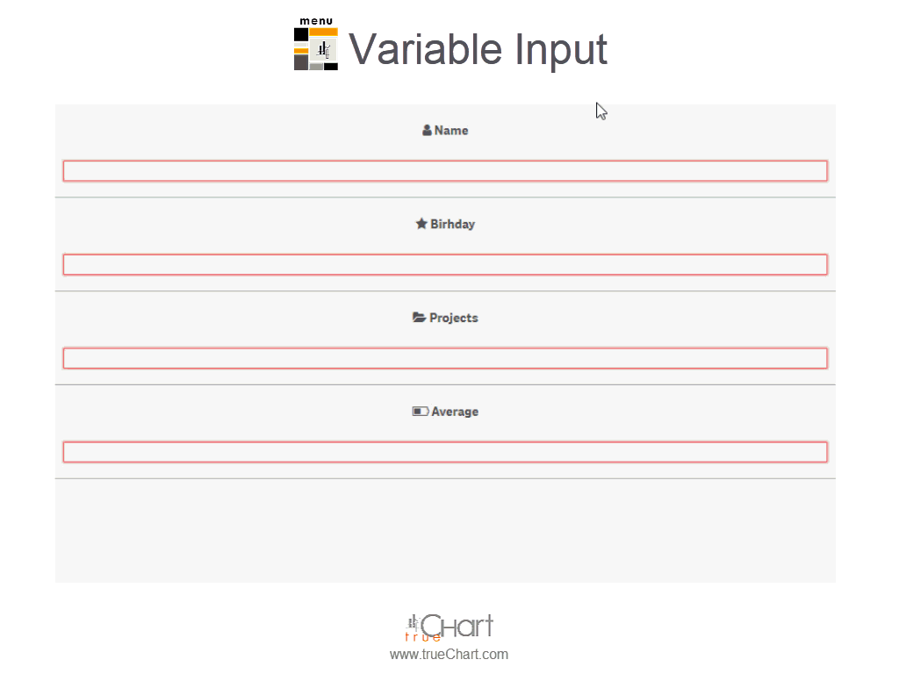

# trueChart-Menubar 

The **trueChart-Menubar** allows for vertical and horizontal buttons and selections 
(fields, drill-down dimensions, master dimensions and variables) as well as unlimited trigger based Actions.

In addition, you can share apps with the current selection with a single click, as well as conveniently chain 
documents including current or changed selections to navigate between apps.
 
This visualization extension supports [Qlik Sense®](http://www.qlik.com/us/products/qlik-sense) 
from version 3.0.0 up to currently latest version June and upcoming version September 2018 including exporting and story mode capability. 

[Get trueChart-Menubar!](https://www.highcoordination.com/downloads/truechart-menubar/) 

## Features

* **Responsive** vertical and horizontal design
* Create **buttons** and assign _Triggers_ and _Actions_ to
  - **navigation** through Qlik Sense and within self-created mashups,
  - one click **app sharing** and **document chaining**,
  - **make selections** (upon button click, after page loading, after selection, 
  bevor navigation or based on your own JS-based custom trigger event),
  - created individual actions based on your own JS code,
* Comprehensive **Button Editor** for button styling,
* Create _Select_ widgets to make **selections** from (drill-down) dimensions.
* Create _Date Picker_ widgets to **select single, multi, range dates** and **custom ranges** by one click
* Create _Variable_ widgets to set **variable values** just by a click, with **variable sliders** or by a **variable input** boxes
* **Maximum space gain** by optionally hiding the Qlik Sense® menus
(menu, selection and title bar) and _Toggle fullscreen_ action
* **Reduction of visual noise** by optional _hiding of snapshot and maximizing buttons_

## Update

### What is new in trueChart-Menubar v1.3.x

**New element Date Picker**

The fully customizable new element Date Picker allows selecting single dates, multiple dates and date ranges for sense fields. With the support of dynamic date formats the Date Picker can select almost every possible date. Standardized and freely customizable date ranges allow a wide variety of date selections with just one click.

**New element Variable Slider**

The new element Variable Slider allows to modify the value of variables in different ways. Three different types are supported: single, range and multi slider.

**New element Variable Input**

The new Variable Input allows you to modify the value of variables with an input field. Variable Inputs blend in with the menu and are only visible when the input is clicked.

**Options to disable sense snapshot and maximize object buttons**

Two new properties in the Sense property panel allow conditional hiding of the snapshot and maximize button.

## Showcase

### Selection and navigation

### Triggers and actions

## Prerequisites

### Qlik Sense® Support
trueChart-Menubar supports Qlik Sense® from version 3.0.0 up to currently
latest version June and upcoming version September 2018 including exporting and story mode capability.

#### nPrinting Support
The trueChart-Menubar does support nPrinting from version June 2018.

### Browser Support
At present trueChart-Menubar supports the browsers listed below:

* Microsoft Internet Explorer 11
* Microsoft Edge (lastest version - v41, at the time of writing)
* Mozilla Firefox (latest version – v61, at the time of writing)
* Google Chrome (latest version – v67, at the time of writing)
* iOS 11.2 or later

The indicated versions are the minimum conditions. In each case, the latest 
version is to be preferred. 

## Download and installation

Here you will find the official release version, which can be used directly in Qlik Sense®.

[Get trueChart-Menubar!](https://www.highcoordination.com/downloads/truechart-menubar/)

### _Qlik Sense Desktop_

For _Qlik Sense Desktop_, simply extract the contents of the ZIP file to your
`Documents/Qlik/Sense/Extensions` folder.

### _Qlik Sense Server_

1. Enter the QMC and navigate to **Manage Resources** → **Extensions**
2. Click the **Import** button at the bottom,
3. In the pop-up dialog, click on **Choose File** to browse the downloaded folder,
4. Click on **Import**.

## Build

In order to further develop the trueChart-Menubar, the git-repo must first be cloned. 
Then perform locally the following step to build an extension that can be used in Qlik Sense®:

1. npm install
2. npm run build
2. npm run zip -> builds/tcmenu-[version]_dev.zip 

## Documentation

The trueChart-Menubar also includes a complete user documentation and from 
installation, configuration to use everything is explained.
The documentation can be accessed through properties panel **Display** → **Info** 
via link **Online Manual** or directly here [User Manual](https://www.highcoordination.com/guides/truechart-menubar/current/).

## Contacts
* Product [trueChart](http://www.truechart.com)
* Web: [HighCoordination GmbH](https://www.highcoordination.com/en)
* Email: [info@highcoordination.de](mailto:info@highcoordination.de)
* Twitter: [Hi_Coordination](https://twitter.com/Hi_Coordination)
* Facebook: [HighCoordination](https://www.facebook.com/HighCoordination)
* LinkedIn: [highcoordination-gmbh](https://www.linkedin.com/company/highcoordination-gmbh)
* Xing: [highcoordinationgmbh](https://www.xing.com/companies/highcoordinationgmbh)

## Links
* [trueChart Website](http://www.truechart.com)
* [trueChart-Menubar Website](https://www.highcoordination.com/en/products/truechart-menubar)
* [Buy trueChart-Menubar support](https://www.highcoordination.com/en/learn-more/contact/?formular=kontaktformular-vertrieb#section-kontaktformular-vertrieb)
* [trueChart-Menubar Support](https://www.highcoordination.com/en/support)
* [trueChart-Menubar Demo](https://sense.highcoordination.de/demo/extensions/HiCoDemo/HiCoDemo.html)

## License

This project is licensed under the terms of the [Apache 2.0 license](./LICENSE).

The project published here can be used directly, but without support. 
For trueChart-Menubar a commercial license including support can be purchased 
via HighCoordination. In particular, this includes support for future versions of 
Qlik Sense® and technical support.

[Buy trueChart-Menubar support](https://www.highcoordination.com/en/learn-more/contact/?formular=kontaktformular-vertrieb#section-kontaktformular-vertrieb)

If you have any questions regarding licensing - please [contact us](https://www.highcoordination.com/en/learn-more/contact).
