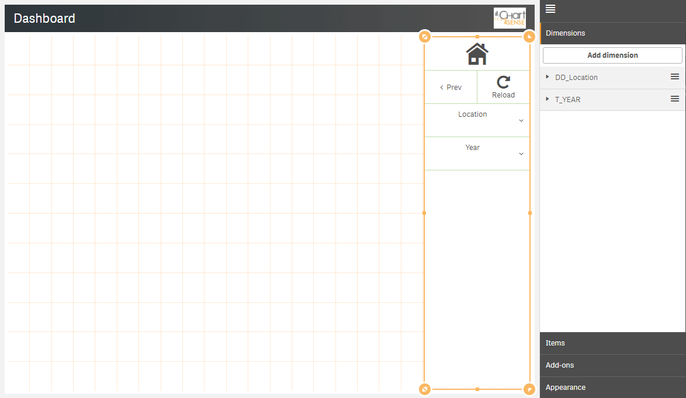

# trueChart-Menubar 

The **trueChart-Menubar** allows for vertical and horizontal buttons and selections 
(fields, master dimensions and variables) as well as unlimited trigger based Actions. 
This visualization extension supports [Qlik Sense®](http://www.qlik.com/us/products/qlik-sense) 
from version 3.0.0 up to currently latest version November 2017 Patch 1 including exporting and story mode capability. 

[Get trueChart-Menubar!](https://www.highcoordination.com/downloads/truechart-menubar/) 

## Features

* **Responsive** vertical and horizontal design
* Create **buttons** and assign _Triggers_ and _Actions_ to
  - navigate through Qlik Sense and within self-created mashups,
  - make selections (upon button click, after page loading, after selection, 
  bevor navigation or based on your own JS-based custom trigger event),
  - created individual actions based on your own JS code,
* Comprehensive **Button Editor** for button styling,
* Create _Select_ widgets to make **selections** from (drill-down) dimensions.
* Create _Variable_ widgets to set **variable values** just by a click.
* **Maximum space gain** by optionally hiding the Qlik Sense® menus 
(menu, selection and title bar) 

## Update

### trueChart-Menubar v1.1.x

> **Features and Improvements**
* **Support of Sense PDF export function** [HICO-2178]
* **Support of drill-down dimensions** in selections (Single, Sense and Multi) [HICO-2560]
* **Conditional display and hiding of menu elements** [HICO-2890]
* Improvement when using master item dimensions and expression-based dimensions [HICO-2524]
* Specify expressions for dimension definition directly [HICO-2601]
* Option to enter title, subtitle or footnote [HICO-2889]
* Mark button+ actions for parallel (faster) or sequential (in order)execution [HICO-40445]
* New position of edit button state in properties panel [HICO-40461]
* Performance: Reduced initial loading time [HICO-40463]

## Showcase

### Selection and navigation

### Triggers and actions

## Prerequisites

### Qlik Sense® Support
trueChart-Menubar supports Qlik Sense® from version 3.0.0 up to currently
latest version November 2017 Patch 1 including exporting and story mode capability.

#### nPrinting Support
The trueChart-Menubar does not yet fully support nPrinting. Expression updates are not 
performed due to technical restrictions. The general export (without expressions) was 
successfully tested with the nPrinting 2017 September version.

### Browser Support
At present trueChart-Menubar supports the browsers listed below:

* Microsoft Internet Explorer 11
* Microsoft Edge
* Mozilla Firefox (latest version – v54, at the time of writing)
* Google Chrome (latest version – v59, at the time of writing)
* Safari for iOS 9

The indicated versions are the minimum conditions. In each case, the latest 
version is to be preferred. 

## Download and installation

Here you will find the official release version, which can be used directly in Qlik Sense®.

[Get trueChart-Menubar!](https://www.highcoordination.com/downloads/truechart-menubar/)

### _Qlik Sense Desktop_

For _Qlik Sense Desktop_, simply extract the contents of the ZIP file to your
`Documents/Qlik/Sense/Extensions` folder.

### _Qlik Sense Server_

1. Enter the QMC and navigate to **Manage Resources** → **Extensions**
2. Click the **Import** button at the bottom,
3. In the pop-up dialog, click on **Choose File** to browse the downloaded folder,
4. Click on **Import**.

## Build

In order to further develop the trueChart-Menubar, the git-repo must first be cloned. 
Then perform locally the following step to build an extension that can be used in Qlik Sense®:

1. npm install
2. npm run build
2. npm run zip -> builds/tcmenu-[version]_dev.zip 

## Documentation

The trueChart-Menubar also includes a complete user documentation and from 
installation, configuration to use everything is explained.
The documentation can be accessed through properties panel **Display** → **Info** 
via link **Manual[PDF]** or directly here [User Manual](./doc/tcmenu.pdf).

## Contacts
* Web: [HighCoordination GmbH](https://www.highcoordination.com/en)
* Email: [info@highcoordination.de](mailto:info@highcoordination.de)
* Twitter: [Hi_Coordination](https://twitter.com/Hi_Coordination)
* Facebook: [HighCoordination](https://www.facebook.com/HighCoordination)
* LinkedIn: [highcoordination-gmbh](https://www.linkedin.com/company/highcoordination-gmbh)
* Xing: [highcoordinationgmbh](https://www.xing.com/companies/highcoordinationgmbh)

## Links
* [trueChart-Menubar Website](https://www.highcoordination.com/en/products/truechart-menubar)
* [Buy trueChart-Menubar support](https://www.highcoordination.com/en/learn-more/contact/?formular=kontaktformular-vertrieb#section-kontaktformular-vertrieb)
* [trueChart-Menubar Support](https://www.highcoordination.com/en/support)
* [trueChart-Menubar Demo](https://sense.highcoordination.de/demo/extensions/HiCoDemo/HiCoDemo.html)

## License

This project is licensed under the terms of the [Apache 2.0 license](./LICENSE).

The project published here can be used directly, but without support. 
For trueChart-Menubar a commercial license including support can be purchased 
via HighCoordination. In particular, this includes support for future versions of 
Qlik Sense® and technical support.

[Buy trueChart-Menubar support](https://www.highcoordination.com/en/learn-more/contact/?formular=kontaktformular-vertrieb#section-kontaktformular-vertrieb)

If you have any questions regarding licensing - please [contact us](https://www.highcoordination.com/en/learn-more/contact).
